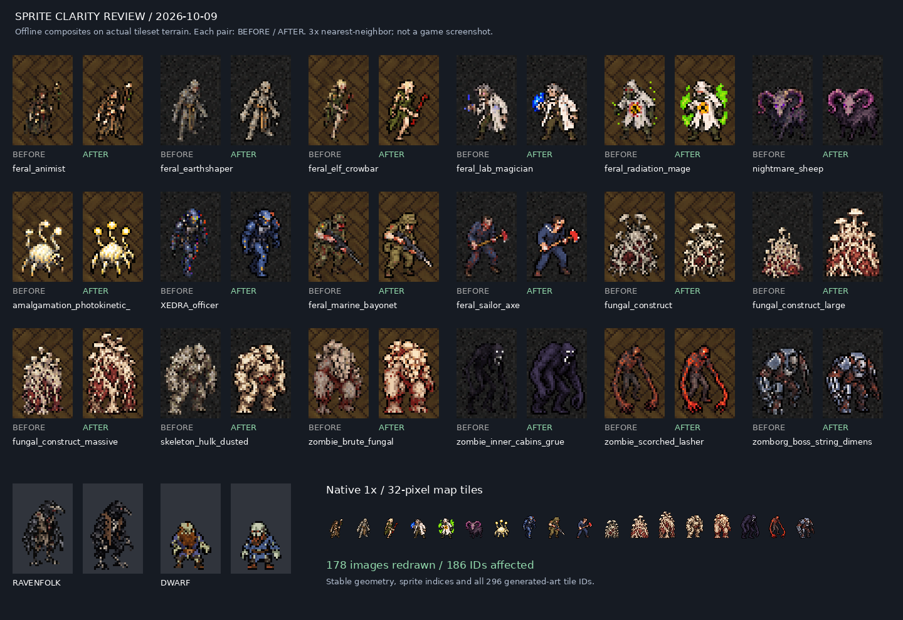

# Generated sprite review — 2026-10-09

Package: **UndeadPeople 3.1.1-r5**. Baseline repository commit:
`f8debb4f8b8177f59fa65bf5602765f776d34e8b`.

The full generated-art scope was inspected: `v3_monsters_20260924.png`,
`v3_ravenfolk.png`, and `v3_zombie_dwarf_crisp.png`. Upstream donor art was
preserved. This supersedes the partial, dwarf-only 2026-10-04 clarity pass.

| Scope | Cells | Used cells | Tile IDs | Redrawn cells | Affected IDs |
|---|---:|---:|---:|---:|---:|
| Monster atlas | 280 | 279 | 294 | 176 | 184 |
| Ravenfolk + dwarf | 2 | 2 | 2 | 2 | 2 |
| Total | 282 | 281 | 296 | 178 | 186 |

The unreferenced last atlas cell is intentionally retained; removing it would
shift subsequent global indices. The 103 other used cells passed visual review
and remain pixel-identical. Every decision, ID, before/after pixel hash, bounding
box and color count is recorded in [2026-10-09.json](2026-10-09.json).

## Findings and fixes

- Dense, noisy shading obscured faces, clothing and equipment at 32x48. Rebuilt
  the affected figures using clearer silhouettes, material color blocks and
  controlled highlights. Changed sprites average approximately 400 opaque RGB
  colors before and 20 after; the production limit is 24. Color count alone is
  not a sharpness metric: each result was also visually reviewed.
- Similar variants lost their distinguishing features. Clarified sailors' tools,
  skeletal claws/scythes, fungal growth, elemental colors and magic effects.
- Dark figures such as the grue lost their body contour on dark terrain. Added
  readable dark-gray/purple body planes while keeping their dark appearance.
- The dwarf's beard obscured its face; the new sprite has a visible pale face,
  eyes, blue tunic and stocky silhouette. Ravenfolk's beak, chest and limbs are
  now clearer.
- The large fungal construct looked smaller than the regular one. Corrected
  normal/large/massive visual progression after reading the exact baseline
  `data/json/monsters/fungus_zombie.json` at CDDA commit
  `e262adb299a7613b4aedc5f12c08fe0413c56a84`.

## Production and invariants

Artwork was redrawn using OpenAI image generation: eleven 16-sprite reference
groups plus two isolated sprites. Prompts preserved species, equipment, variant
colors and poses, asking for simple low-resolution UndeadPeople/MSX-style art,
flat clusters, dark contours and transparent backgrounds.

Generated preview sheets are not installed. Each sprite was extracted through
an empty-alpha gutter, trimmed, sampled with nearest-neighbor, palette-limited
without dithering, and packed into its original slot. This avoids assuming that
image generation can exactly preserve atlas cell boundaries. Alpha is binary;
updated cells have at least one pixel of side/top margin and two pixels below
their baseline. Most original silhouette heights were retained; the fungal
construct progression is the deliberate size correction.

All source `tile_config.json` bytes, IDs, global indices, 32x48 / 32x32 geometry,
offsets and atlas dimensions are unchanged. The atlas has 176 changed cells and
104 pixel-identical cells, including its unused cell. All other PNGs are unchanged.
Existing donor attribution and licenses are retained.

## Visual evidence

These are **offline composites**, not screenshots from a running CDDA game.
Actual floor/pavement textures are used, with native-size examples and 3x
nearest-neighbor enlargement. No smoothing is used to make the previews look
better than the installed pixels.



Full paired review panels for all 176 atlas replacements:

| Group | Subjects | Panel |
|---|---|---|
| A | Mages, druids, earthshapers, elves | [Before / after](comparison-A.png) |
| B | Fantasy humanoids and magic zombies | [Before / after](comparison-B.png) |
| C | Psionic ferals and energy variants | [Before / after](comparison-C.png) |
| D | Psychic undead, revenants, monochrome | [Before / after](comparison-D.png) |
| E | Officers, beekeepers, sailors, ferals | [Before / after](comparison-E.png) |
| F | Serum ferals, plant cyborgs, skeletons | [Before / after](comparison-F.png) |
| G | Skeletons, brutes, children, crawlers | [Before / after](comparison-G.png) |
| H | Fireproof zombies, hulks, grue | [Before / after](comparison-H.png) |
| I | Scorched, smokers, wretches, zomborg | [Before / after](comparison-I.png) |
| J | Fantasy creatures, plant monsters, amalgamations | [Before / after](comparison-J.png) |
| K | Demons, fungal constructs, machines | [Before / after](comparison-K.png) |

## Verification

- Source: 72 valid PNG sheets, 59,990 sprite slots, 46,008 valid references.
- Built installer payload: 75 sheets, 61,942 slots, 48,925 references, including
  appended Secronom art. All 296 generated-art IDs still resolve correctly.
- The exact 46 existing Secronom duplicate/override definitions are recorded in
  the ledger. None targets generated-art IDs. New duplicate definitions fail.
- Pixel hashes cover all 282 reviewed cells. Tests detect empty replacements,
  soft alpha, boundary bleed, invalid references and invalid sheet dimensions.
- Local `modsuite.py build` produced all eight installable packages; all 76
  Python tests passed. Windows installer/native checks are provided by normal CI.

Run the audit locally:

```sh
python -m pip install -r tools/sprite-qa-requirements.txt
python tools/audit_generated_sprites.py
python tools/modsuite.py build
python tools/audit_generated_sprites.py --package dist/undeadpeople-3.1.1-r5-baseline.zip
python -m unittest discover -s tests -p 'test_*.py'
```

No new CDDA compatibility target is introduced. An interactive game-session
check on the user's actual display/zoom remains outstanding; offline review
cannot certify their renderer/filter settings or every terrain/lighting state.
